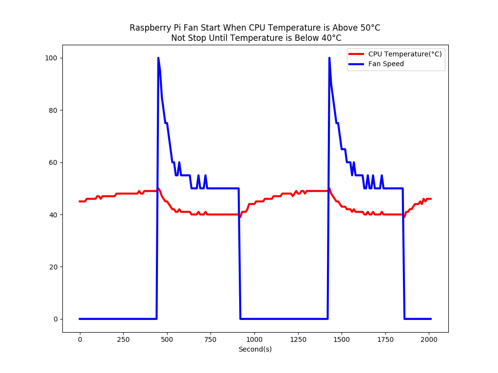

# PWM Regulated Fan Based on CPU Temperature for Raspberry Pi

After everything is connected, run `fan.py` on Raspberry Pi, it will save CPU temperature and fan speed to database.

Open database with `sqlite3`, and execute:

```
select cpu_temp,fan_speed from cpu_temp;
```

Copy data to `sample.txt`, then run `plot_data.py` to get data ploted.




## Reference

 - [PWM Regulated Fan Based on CPU Temperature for Raspberry Pi](https://www.instructables.com/id/PWM-Regulated-Fan-Based-on-CPU-Temperature-for-Ras/)
